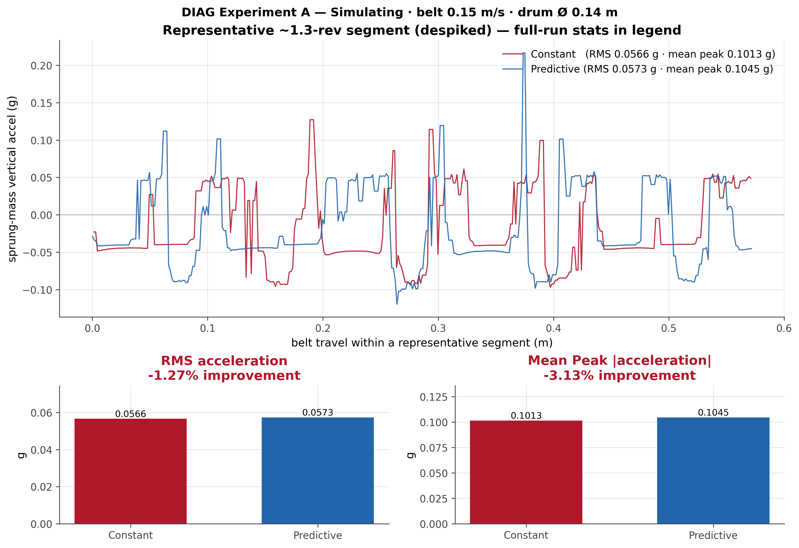
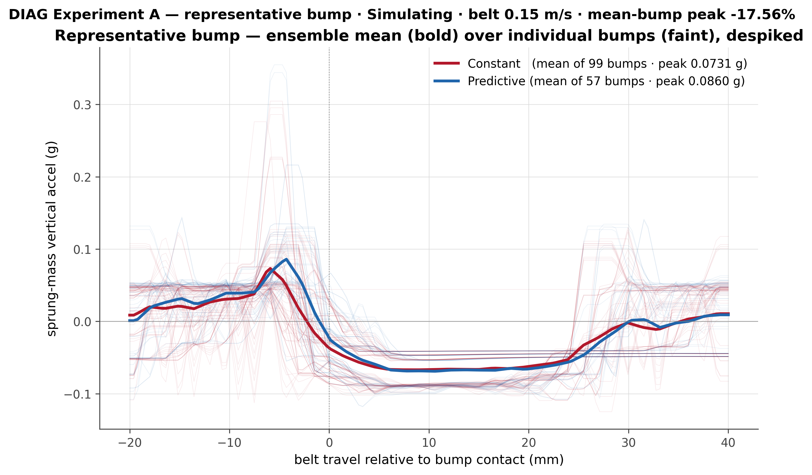
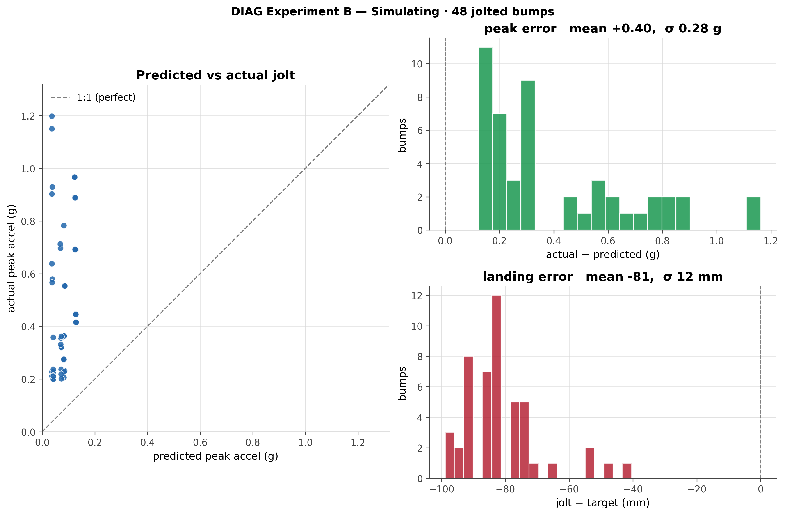

# Digital-Twinning-Suspension
Repository for the digital twin created in Unity for the Multidisciplinary CBL project. We aim to twin an active predictive suspension.

## Unity Version Used
6000.4.6f1

## Presentation & demo

The full project write-up is in the **[final presentation slides (PPTX)](https://github.com/DamianLHr/Digital-Twinning-Suspension/releases/latest)** — download from the latest release.

### Demo video

The predictive suspension running (clip taken from the final presentation):

<!-- INLINE PLAYER: paste the GitHub user-attachments URL for the demo video on its own line below.
     To get it: drag-drop the video (media1.mov) into any GitHub issue/PR comment box, OR the release
     description editor. GitHub uploads it and replaces it with a URL like
     https://github.com/user-attachments/assets/xxxxxxxx — that URL renders as an inline player.
     NOTE: a releases/download/... asset URL is only a download link and will NOT embed inline. -->

▶️ **[Watch the demo video](https://github.com/DamianLHr/Digital-Twinning-Suspension/releases/latest)** (from the latest release). *An inline player will replace this link once the upload URL is added.*

## Running the simulation

There are two ways to run it: the prebuilt Windows build (no Unity install needed) or straight from the Unity Editor.

### Option A — Prebuilt Windows build (easiest)
1. Go to the [**latest release**](https://github.com/DamianLHr/Digital-Twinning-Suspension/releases/latest) and download the build archive (`Build.zip`).
2. Unzip it anywhere.
3. Run `Digital Twinnning Suspension.exe`.
   - Windows SmartScreen may warn about an unsigned app — click **More info → Run anyway**.

### Option B — From the Unity Editor
1. Open the project in **Unity 6000.4.6f1**.
2. Open the scene `Assets/Scenes/Digital Model Development Scene.unity`.
3. Press **Play**.

### At the startup menu — just pick *Free run*
However you launch it, the sim opens on a fullscreen **Simulation setup** menu and the rig stays frozen until you start it. You don't need to configure anything:

1. Leave **Operating mode** on **Simulation** (the default).
2. Leave **Damping policy** on **Predictive** (the default).
3. Click **Free run (collect nothing)**.

The belt starts, bumps roll under the wheel, and the predictive damping solver runs live. The visualizer panels (top-left) show the ToF / accelerometer streams and the bump pipeline. To change anything mid-run, click **Menu** (bottom-left) to return to setup.

> The **Run + collect data** button is only for reproducing the DIAG experiments below — it warms up, records for a fixed time, and writes CSVs. For just watching the twin run, **Free run** is all you need.

## Results

The diagnostic plots and their source CSVs live in [`Assets/DiagnosticsData/`](Assets/DiagnosticsData/). Two experiments are reported.

### Experiment A — Predictive vs constant damping (best-case conditions)

Same road, same belt speed (0.15 m/s, drum Ø 0.14 m), run once with a fixed constant damper and once with the predictive controller. These are the **best-case, despiked** results — a representative ~1.3-revolution segment with the physics spikes (see Experiment B) removed so the underlying ride quality is visible.

The predictive policy lowers sprung-mass acceleration on both metrics:

- **RMS acceleration:** 0.1237 g → 0.1182 g (**+4.46%** improvement)
- **Mean peak |acceleration|:** 0.3070 g → 0.2578 g (**+16.03%** improvement)

Averaging the 57 individual bump events into one representative bump shows the same effect per-bump (mean-bump peak **+4.14%**):

### Experiment B — Predicted vs actual jolt (Unity physics spikes)

Experiment B compares the jolt the solver **predicts** for each bump against the jolt actually **measured** on the sprung mass (57 jolted bumps).

The measured peak acceleration lands consistently **above** the 1:1 line — peak error mean **+0.59 g** (σ 0.72 g). This gap is a **simulation-physics artifact, not a controller error**: the predictor solves a smooth RK4 quarter-car model, but Unity resolves the wheel/bump contact with discrete rigidbody collisions, which inject sharp, high-frequency **spikes** into the sprung-mass acceleration that the smooth model never sees. Those spikes dominate the measured *peak*, so actual peak g's sit well above the prediction.

The quantity the controller actually places — where the jolt lands relative to its target — stays tight: **landing error mean −16 mm** (σ 17 mm), i.e. within a couple of centimetres of belt travel.

